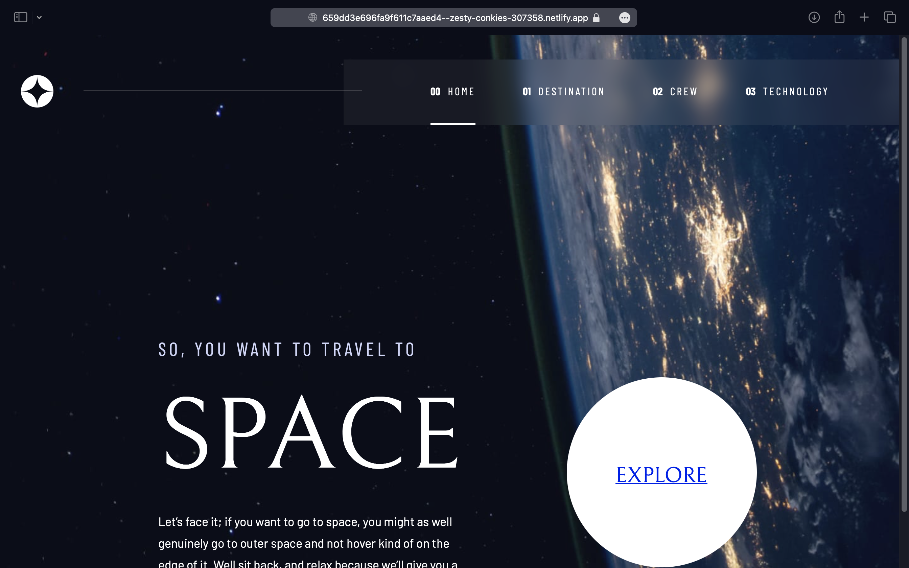
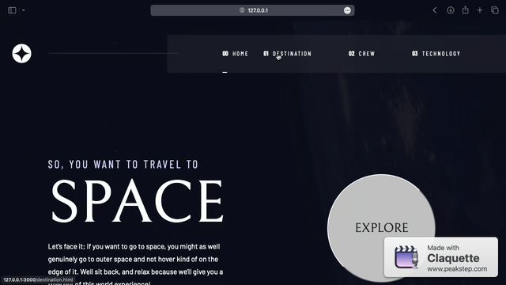

# Frontend Mentor - Space tourism website solution

This is a solution to the [Space tourism website challenge on Frontend Mentor](https://www.frontendmentor.io/solutions/space-tourism-4xwx3G7bWi). Frontend Mentor challenges help you improve your coding skills by building realistic projects. 

## Table of contents

- [Overview](#overview)
  - [The challenge](#the-challenge)
  - [Screenshot](#screenshot)
  - [Links](#links)
- [My process](#my-process)
  - [Built with](#built-with)
  - [What I learned](#what-i-learned)
  - [Useful resources](#useful-resources)
- [Author](#author)

## Overview
#### The challenge

Users should be able to:

- View the optimal layout for each of the website's pages depending on their device's screen size
- See hover states for all interactive elements on the page
- View each page and be able to toggle between the tabs to see new information

### Screenshot



### Links

- Solution URL: [Add solution URL here](https://www.frontendmentor.io/solutions/space-tourism-4xwx3G7bWi)
- Live Site URL: [Add live site URL here](https://659dd3e696fa9f611c7aaed4--zesty-conkies-307358.netlify.app)

## My process

### Built with

- Semantic HTML5 markup
- CSS custom properties
- Flexbox
- Mobile-first workflow
- [GSAP](https://gsap.com) - JS library - Animations
- [Barba JS](https://barba.js.org) - React framework) - Page transistions 


### What I learned

I could spend days adjusting the Barba/GSAP integration. Making the pages smoothly transition was not to difficult when testing on Firefox/Chrome browsers. But on Safari the page indicator appeared to not complete the animation. 



I was able to mitigate the animation by swapping the ```width``` value in the gsap animations to use ```scaleX``` instead.

```js
ActiveNav.js - line 7
gsap.fromTo(this.marker, {autoAlpha: 0, visibility:'visible', opacity: 0, scaleX:'0%'}, {ease:'sine.out', autoAlpha: 1, transformOrigin: 'left', visibility:'visible', opacity: 1, scaleX:'100%'})
```

### Useful resources

- [GSAP Cheatsheet](https://www.example.com) - Main resource to add transition/svg animations.
- [Barba Docs](https://www.example.com) - Documentation used to implement page transistions


## Author

- Website - [Brian Thomas](https://brianthomas-develops.com)
- Frontend Mentor - [@joyreacher](https://www.frontendmentor.io/profile/joyreacher)
